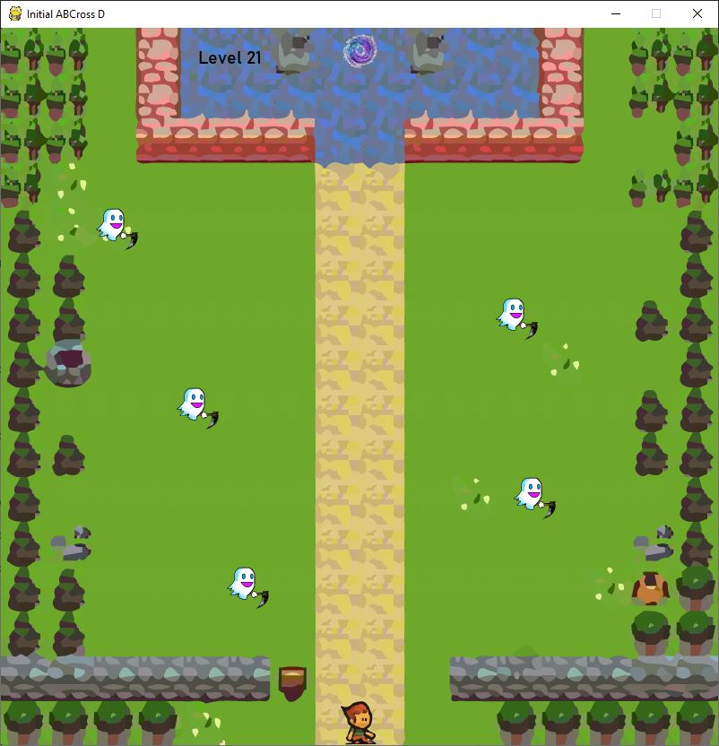

# Initial ABCross D

## Description
Initial ABCross D is a frogger-like game. 

### Preview:

## More about this project

### Related course
ZENVA | LEARN PYTHON PROGRAMMING BY MAKING A GAME

### Technologies | Libraries | Frameworks | Tools  
- Python 3  
- PyGame

### Details | Comments
- Albeit this project was made coding along while following the related course, several changes have been made from the original project.  

### Status
Completed

#### Last update
12/03/2020

#### Last update (README.md)
26/05/2020
